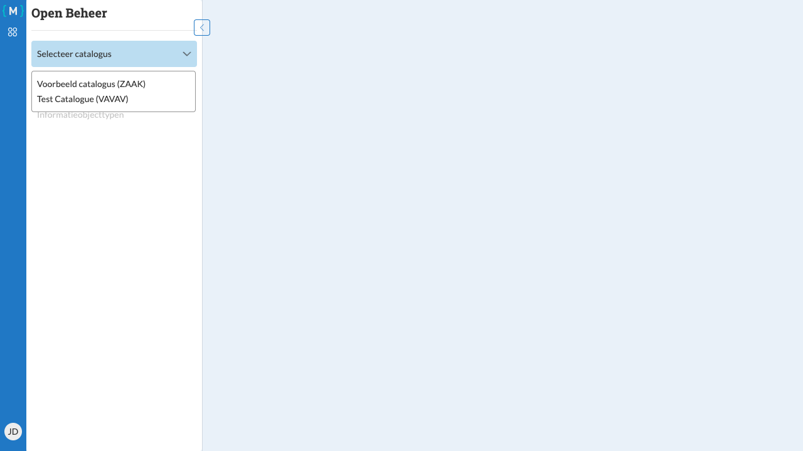

========================
Catalogus selecteren
========================

   Catalogus selectie dropdown

Na het inloggen moet u een catalogus selecteren waarmee u wilt werken. Een catalogus bevat alle zaaktypen en informatieobjecttypen voor een specifiek domein.

Stappen
=======

1. Log in op de applicatie (zie :doc:`login`)
2. Klik op het dropdown-veld **Selecteer catalogus**

3. Selecteer de gewenste catalogus uit de lijst. Elke catalogus wordt weergegeven met zijn naam en domein, bijvoorbeeld: "Catalogus naam (domein)"
4. De applicatie laadt nu de gegevens van de geselecteerde catalogus

Na het selecteren van een catalogus kunt u aan de slag met het beheren van zaaktypen en informatieobjecttypen binnen deze catalogus.

.. note::
   U kunt op elk moment een andere catalogus selecteren door opnieuw het dropdown-veld te gebruiken.
