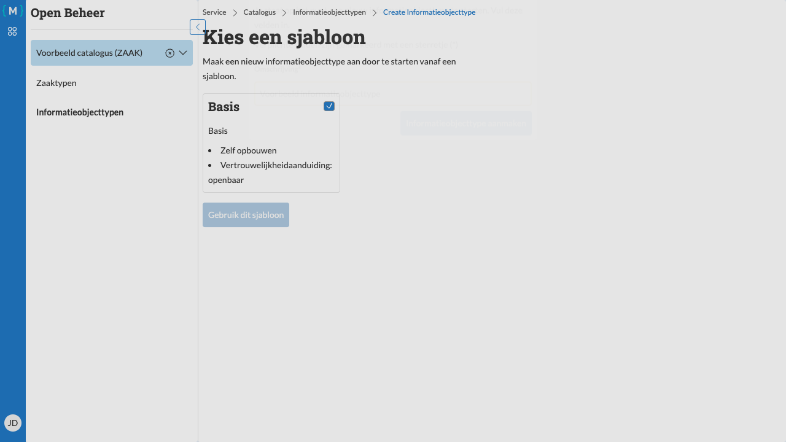

=============================
Informatieobjecttype aanmaken
=============================

   Nieuw informatieobjecttype aanmaken

U kunt nieuwe informatieobjecttypen aanmaken vanuit een sjabloon. Dit versnelt het proces doordat veel standaardvelden al zijn ingevuld.

Stappen
=======

1. Navigeer naar het informatieobjecttypen overzicht (zie :doc:`overzicht`)
2. Klik op de link **Nieuw informatieobjecttype**

Een sjabloon selecteren
-----------------------

3. Selecteer een sjabloon door het bijbehorende vakje aan te vinken (bijvoorbeeld **Basis**)
4. Klik op de knop **Gebruik dit sjabloon**

Informatieobjecttype gegevens invullen
---------------------------------------

5. Vul de verplichte velden in:

   - **Omschrijving**: Een beschrijvende naam voor het informatieobjecttype (bijvoorbeeld "Voorbeeld informatieobjecttype")

6. Klik op **Informatieobjecttype aanmaken**

Resultaat
=========

Het nieuwe informatieobjecttype wordt aangemaakt en u wordt doorgestuurd naar de detailpagina. Het informatieobjecttype wordt aangemaakt met de status "Concept".

Op de detailpagina kunt u:

- Verdere details toevoegen en bewerken (zie :doc:`bewerken`)
- Het informatieobjecttype publiceren wanneer het compleet is (zie :doc:`publiceren`)

.. note::
   Een nieuw informatieobjecttype is altijd in concept-status. U moet het informatieobjecttype publiceren voordat het gebruikt kan worden.
