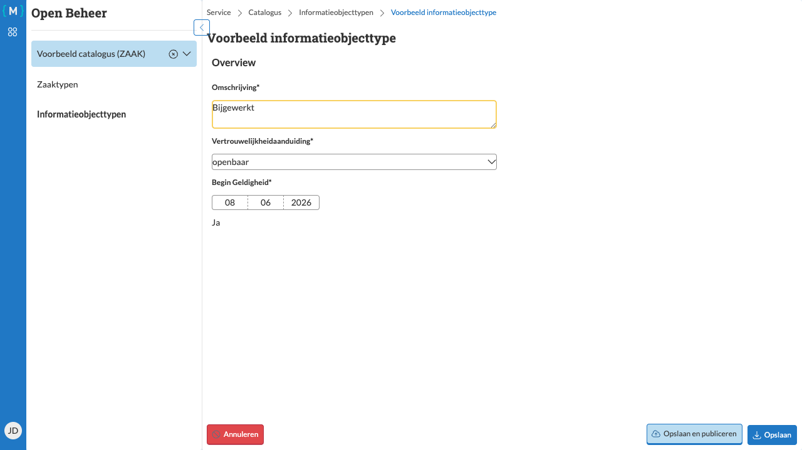

=============================
Informatieobjecttype bewerken
=============================

   Informatieobjecttype bewerken

U kunt de eigenschappen van een informatieobjecttype bewerken zolang het informatieobjecttype nog in concept-status is.

Stappen
=======

1. Navigeer naar de detailpagina van het gewenste informatieobjecttype
2. Klik op de knop **Bewerken**

3. Pas de gewenste velden aan, bijvoorbeeld:

   - **Omschrijving**: Een beschrijvende naam
   - **Categorie**: De categorie waartoe het informatieobjecttype behoort
   - **Vertrouwelijkheidaanduiding**: Het niveau van vertrouwelijkheid
   - Andere eigenschappen zoals trefwoorden, formaat, etc.

4. Klik op **Opslaan** om de wijzigingen op te slaan

Resultaat
=========

De wijzigingen zijn opgeslagen en u keert terug naar de weergavemodus. De knop **Bewerken** is weer zichtbaar en u kunt de bijgewerkte informatie zien.

.. note::
   Zorg ervoor dat alle verplichte velden zijn ingevuld voordat u het informatieobjecttype publiceert.

.. warning::
   Na publicatie van een informatieobjecttype kunnen bepaalde velden niet meer worden gewijzigd.
