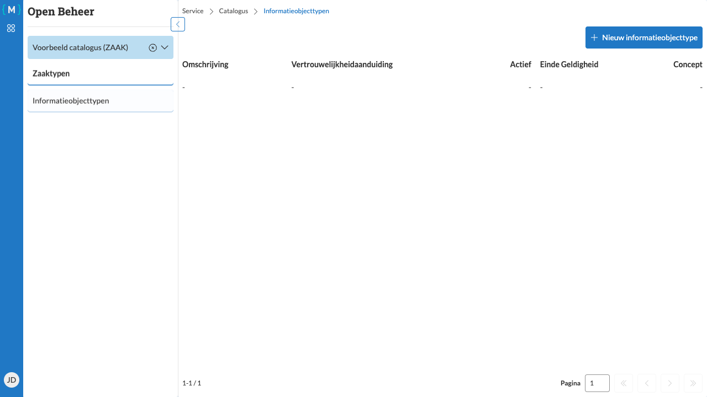

===================================
Informatieobjecttypen overzicht
===================================

   Informatieobjecttypen overzicht tabel

Het informatieobjecttypen overzicht geeft een volledig overzicht van alle informatieobjecttypen binnen de geselecteerde catalogus.

Naar het overzicht navigeren
============================

1. Log in en selecteer een catalogus (zie :doc:`../login` en :doc:`../catalogus-selecteren`)
2. Klik in het hoofdmenu op de knop **Informatieobjecttypen**

Het overzicht
=============

Het overzicht toont een tabel met de volgende kolommen:

**Identificatie**
   Het unieke identificatienummer van het informatieobjecttype

**Omschrijving**
   Een beschrijvende naam van het informatieobjecttype

**Vertrouwelijkheidaanduiding**
   Het niveau van vertrouwelijkheid (bijvoorbeeld openbaar, intern)

**Versiedatum**
   De datum waarop deze versie van het informatieobjecttype geldig werd

**Actief**
   Geeft aan of het informatieobjecttype actief is (Ja/Nee)

**Einde Geldigheid**
   De datum waarop het informatieobjecttype niet meer geldig is (indien van toepassing)

**Concept**
   Geeft aan of het informatieobjecttype nog een concept is (Ja) of al gepubliceerd is (Nee)

Acties
======

Vanuit dit overzicht kunt u:

- Klikken op een informatieobjecttype om de details te bekijken
- Een nieuw informatieobjecttype aanmaken via de knop **Nieuw informatieobjecttype** (zie :doc:`aanmaken`)
