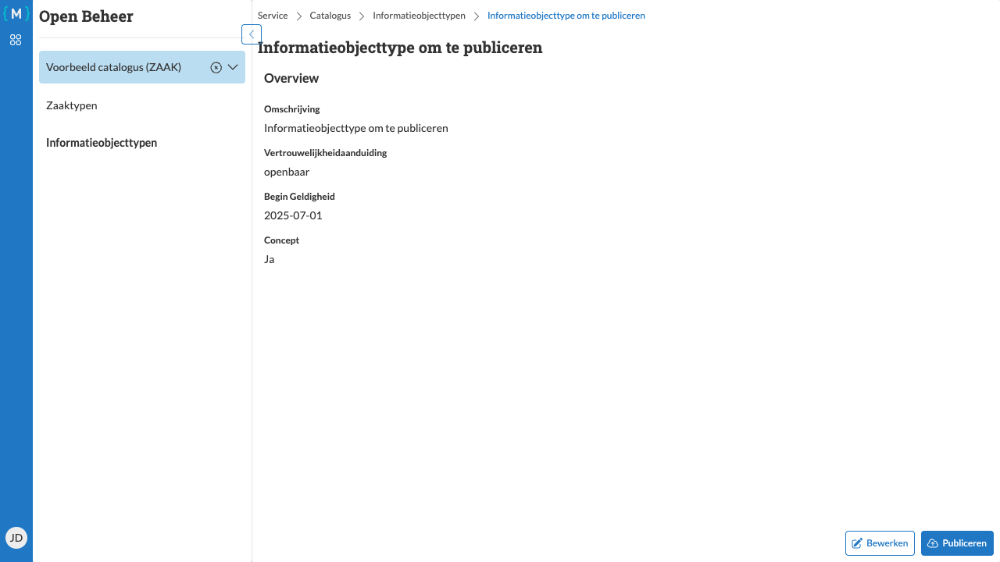

====================================
Informatieobjecttype publiceren
====================================

   Informatieobjecttype publiceren

Een informatieobjecttype moet worden gepubliceerd voordat het gebruikt kan worden en gekoppeld kan worden aan zaaktypen.

Vereisten voor publicatie
==========================

Voordat u een informatieobjecttype kunt publiceren, moet het aan bepaalde eisen voldoen:

**Alle verplichte velden ingevuld**
   Alle verplichte velden moeten zijn ingevuld, waaronder:

   - Omschrijving
   - Categorie
   - Vertrouwelijkheidaanduiding

.. note::
   De applicatie controleert automatisch of aan alle vereisten is voldaan.

Stappen
=======

1. Zorg ervoor dat het informatieobjecttype compleet is (zie :doc:`bewerken`)
2. Navigeer naar de detailpagina van het informatieobjecttype
3. Controleer of de status "Concept: Ja" wordt weergegeven
4. Klik op de knop **Publiceren**

Resultaat
=========

Het informatieobjecttype is nu gepubliceerd en de status verandert naar "Concept: Nee". Het informatieobjecttype kan nu:

- Worden gebruikt voor het registreren van documenten
- Worden gekoppeld aan zaaktypen via zaaktypeinformatieobjecttypen (zie :doc:`../zaaktypen/gerelateerde-objecten`)

.. warning::
   Na publicatie kunnen bepaalde eigenschappen van het informatieobjecttype niet meer worden gewijzigd. Als u toch wijzigingen wilt aanbrengen, moet u een nieuwe versie aanmaken.

Nieuwe versie aanmaken
======================

Als u een gepubliceerd informatieobjecttype wilt wijzigen:

1. Maak een nieuwe versie aan met een nieuwe begindatum geldigheid
2. Voer de gewenste wijzigingen door
3. Publiceer de nieuwe versie
4. Stel eventueel een einddatum geldigheid in voor de oude versie

.. tip::
   Plan uw informatieobjecttypen zorgvuldig. Publiceer alleen informatieobjecttypen die volledig zijn gecontroleerd en goedgekeurd.
