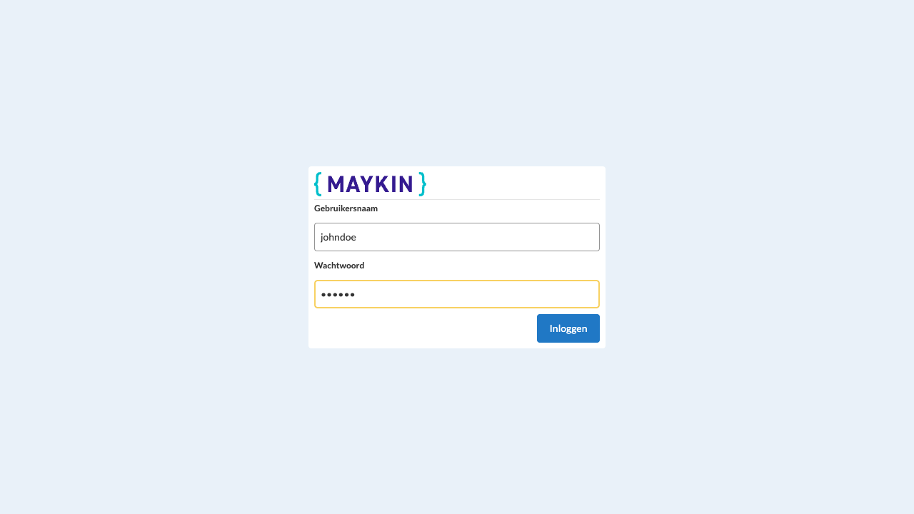
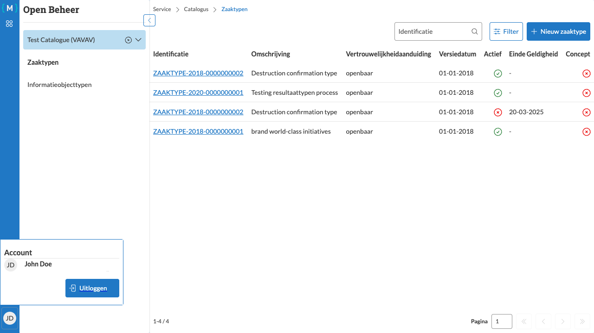

========================
Inloggen en uitloggen
========================

   Inlogscherm met gebruikersnaam en wachtwoord velden

Inloggen
========

Om met Open Beheer te kunnen werken, moet u eerst inloggen met uw gebruikersgegevens.

Stappen
-------

1. Open de Open Beheer applicatie in uw webbrowser
2. Voer uw **Gebruikersnaam** in
3. Voer uw **Wachtwoord** in
4. Klik op de knop **Inloggen**

Na succesvol inloggen wordt u doorgestuurd naar het hoofdscherm van Open Beheer.

Uitloggen
=========

   Profiel menu met uitlog optie

U kunt op elk moment uitloggen uit de applicatie.

Stappen
-------

1. Klik rechtsboven op de knop **Profiel** (weergegeven als uw initialen)
2. In het menu dat verschijnt, ziet u uw accountgegevens
3. Klik op **Uitloggen**

U wordt nu uitgelogd en teruggebracht naar het inlogscherm.
