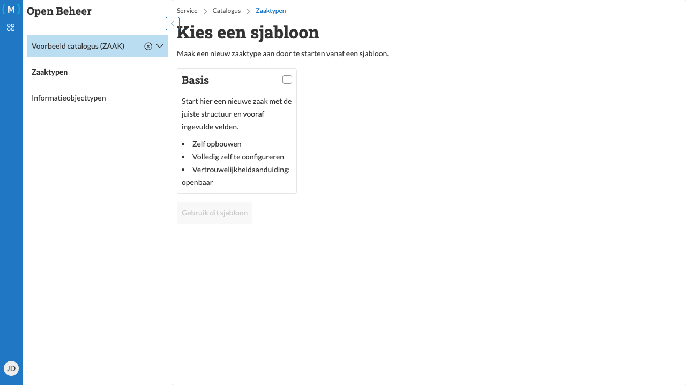

=================
Zaaktype aanmaken
=================

   Nieuw zaaktype aanmaken met sjabloon selectie

U kunt nieuwe zaaktypen aanmaken vanuit een sjabloon. Dit versnelt het proces doordat veel standaardvelden al zijn ingevuld.

Stappen
=======

1. Navigeer naar het zaaktypen overzicht (zie :doc:`overzicht`)
2. Klik op de link **Nieuw zaaktype**

Een sjabloon selecteren
-----------------------

3. Selecteer een sjabloon door het bijbehorende vakje aan te vinken (bijvoorbeeld **Basis**)
4. Klik op de knop **Gebruik dit sjabloon**

.. hint::
  Een bestaand zaaktype kan gebruikt worden als sjabloon voor een nieuw zaaktype, klik hiervoor tijdens het bewerken van
  het bestaande zaaktype op de knop **Opslaan als**.

Zaaktype gegevens invullen
---------------------------

5. Vul de verplichte velden in:

   - **Identificatienummer**: Een uniek identificatienummer voor het zaaktype (bijvoorbeeld "gh-305")
   - **Omschrijving**: Een beschrijvende naam voor het zaaktype (bijvoorbeeld "Voorbeeld zaaktype")

6. Klik op **Zaaktype aanmaken**

Resultaat
=========

Het nieuwe zaaktype wordt aangemaakt en u wordt doorgestuurd naar de detailpagina. Het zaaktype wordt aangemaakt met de status "Concept".

Op de detailpagina kunt u:

- Het tabblad **Algemeen** selecteren om alle algemene informatie te bekijken
- Verdere details toevoegen en bewerken (zie :doc:`bewerken`)
- Gerelateerde objecten toevoegen (zie :doc:`gerelateerde-objecten`)

.. note::
   Een nieuw zaaktype is altijd in concept-status. U moet het zaaktype publiceren voordat het gebruikt kan worden (zie :doc:`publiceren`).
