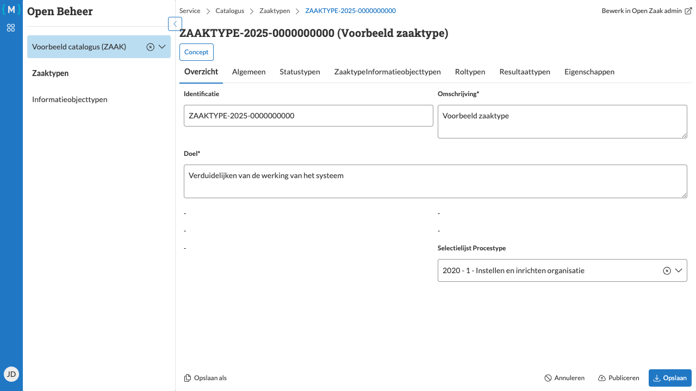

========================
Zaaktype bewerken
========================

   Zaaktype bewerken in bewerkingsmodus

U kunt de eigenschappen van een zaaktype bewerken zolang het zaaktype nog in concept-status is, of een nieuwe versie aanmaken van een gepubliceerd zaaktype.

Stappen
=======

1. Navigeer naar de detailpagina van het gewenste zaaktype (zie :doc:`navigeren`)
2. Selecteer het tabblad waar u wijzigingen wilt maken, bijvoorbeeld **Overzicht**
3. Klik op de knop **Bewerken**
4. Pas de gewenste velden aan, bijvoorbeeld:

   - **Doel**: Het doel of de doelstelling van het zaaktype
   - **Selectielijst**: De te gebruiken selectielijst en procestype (bijvoorbeeld "2020 - 1 -")
   - Andere velden zoals aanleiding, indicaties, referentieproces, etc.

5. Klik op **Opslaan** om de wijzigingen op te slaan

.. hint::
  Een bestaand zaaktype kan gebruikt worden als sjabloon voor een nieuw zaaktype, klik hiervoor tijdens het bewerken van
  het bestaande zaaktype op de knop **Opslaan als**.

Resultaat
=========

De wijzigingen zijn opgeslagen en u keert terug naar de weergavemodus. De knop **Bewerken** is weer zichtbaar en u kunt de bijgewerkte informatie zien.

.. note::
   Sommige velden zijn verplicht voor publicatie. Zorg ervoor dat alle verplichte velden zijn ingevuld voordat u het zaaktype publiceert.

.. warning::
   Na publicatie van een zaaktype kunnen bepaalde velden niet meer worden gewijzigd. In dat geval moet u een nieuwe versie van het zaaktype aanmaken.
