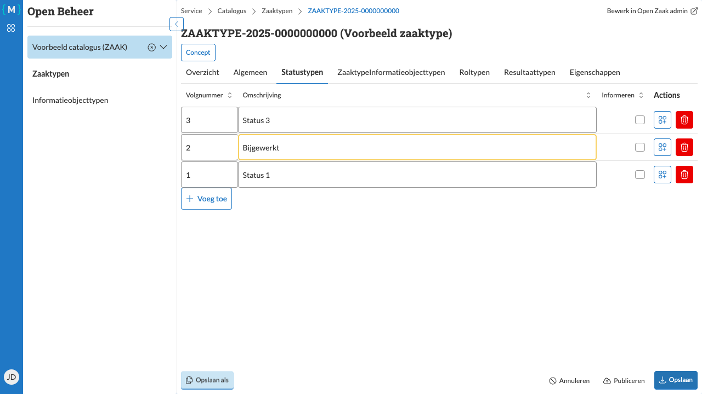
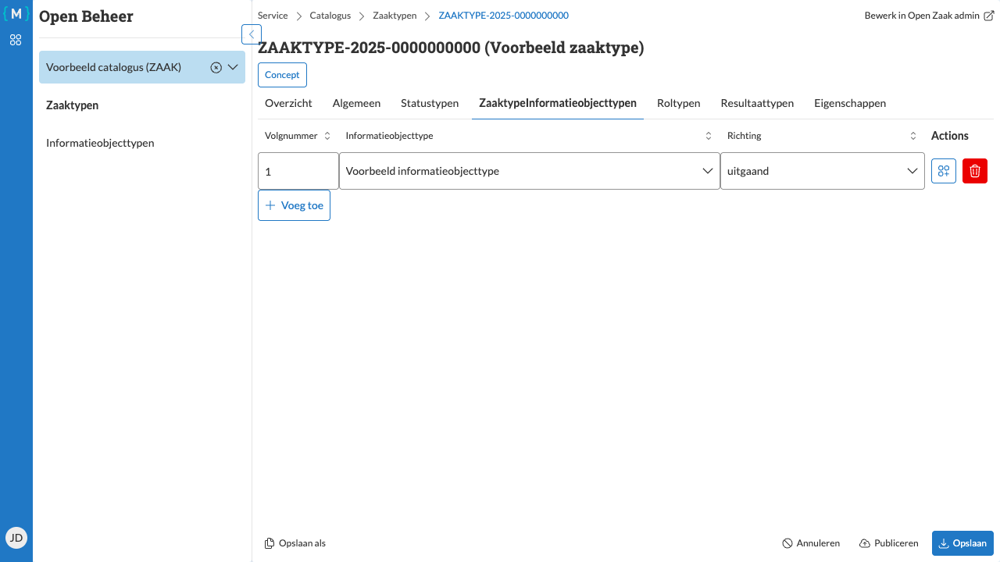
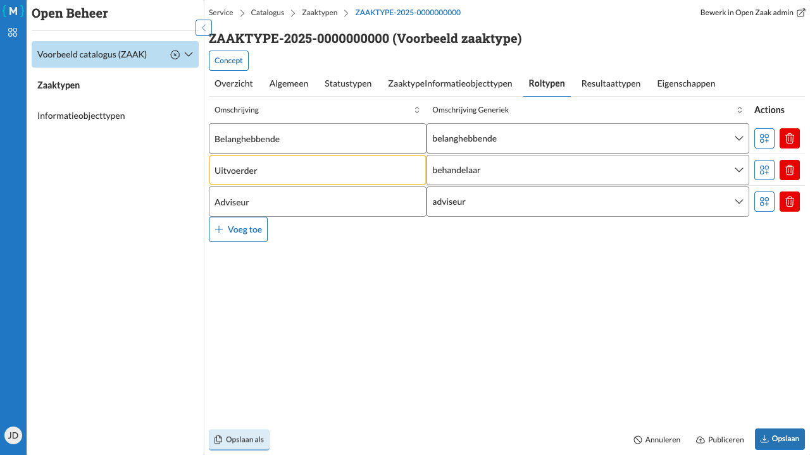
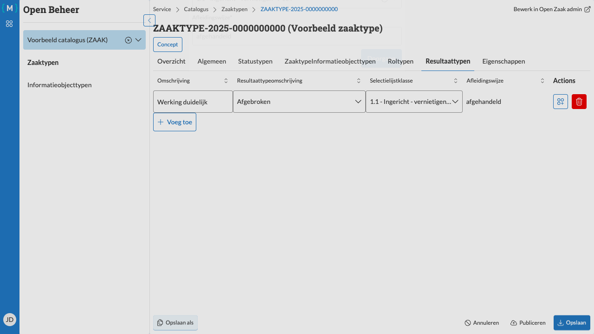
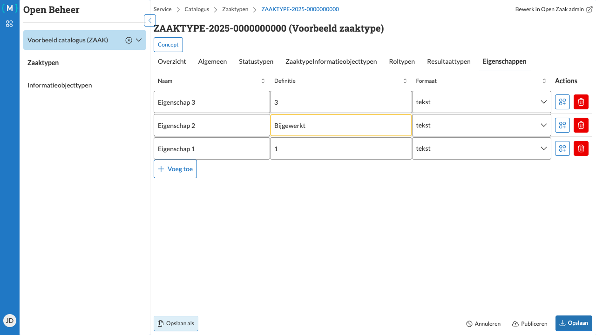

=============================
Gerelateerde objecten beheren
=============================

   Statustypen bewerken

Een zaaktype heeft verschillende gerelateerde objecten die het gedrag en de eigenschappen van zaken bepalen. Deze objecten kunt u beheren via de verschillende tabbladen op de zaaktype detailpagina.

Statustypen beheren
===================

Statustypen bepalen welke statussen een zaak van dit type kan doorlopen.

Toevoegen
---------

1. Navigeer naar de detailpagina van het zaaktype
2. Selecteer het tabblad **Statustypen**
3. Klik op **Bewerken**
4. Klik op **Voeg toe** om een nieuw statustype toe te voegen
5. Vul de **Omschrijving** in (bijvoorbeeld "Status 1", "Status 2", "Status 3")
6. Klik op **Opslaan**

Wijzigen
--------

1. Klik op **Bewerken**
2. Pas de gewenste velden aan, bijvoorbeeld de **Omschrijving** van een bestaand statustype
3. Klik op **Opslaan**

Verwijderen
-----------

1. Klik op **Bewerken**
2. Klik bij het te verwijderen statustype op **Verwijderen**
3. Klik op **Opslaan**

Zaaktypeinformatieobjecttypen beheren
=====================================

   Zaaktypeinformatieobjecttypen bewerken

Zaaktypeinformatieobjecttypen leggen de koppeling tussen zaaktypen en informatieobjecttypen, inclusief de richting van de relatie.

.. note::
   Het toevoegen van een zaaktypeinformatieobjecttype vereist een gepubliceerd informatieobjecttype binnen dezelfde
   catalogus (zie :doc:`../informatieobjecttypen/bewerken`).

Toevoegen
---------

1. Selecteer het tabblad **Zaaktypeinformatieobjecttypen**
2. Klik op **Bewerken**
3. Klik op **Voeg toe**
4. Selecteer een **Informatieobjecttype** uit de lijst
5. Kies de **Richting** (bijvoorbeeld "inkomend", "uitgaand")
6. Klik op **Opslaan**

Wijzigen
--------

1. Klik op **Bewerken**
2. Pas de **Richting** of andere eigenschappen aan
3. Klik op **Opslaan**

Verwijderen
-----------

1. Klik op **Bewerken**
2. Klik op **Verwijderen** bij de te verwijderen relatie
3. Klik op **Opslaan**

Roltypen beheren
================

   Roltypen bewerken

Roltypen bepalen welke rollen betrokken kunnen zijn bij zaken van dit type.

Toevoegen
---------

1. Selecteer het tabblad **Roltypen**
2. Klik op **Bewerken**
3. Klik op **Voeg toe** om een nieuw roltype toe te voegen
4. Vul de velden in:

   - **Omschrijving**: De specifieke omschrijving voor dit zaaktype (bijvoorbeeld "Adviseur", "Behandelaar")
   - **Omschrijving Generiek**: De generieke omschrijving van de rol

5. Herhaal voor meerdere roltypen
6. Klik op **Opslaan**

Wijzigen
--------

1. Klik op **Bewerken**
2. Pas de **Omschrijving** of andere velden aan
3. Klik op **Opslaan**

Verwijderen
-----------

1. Klik op **Bewerken**
2. Klik bij het te verwijderen roltype op **Verwijderen**
3. Klik op **Opslaan**

Resultaattypen beheren
======================

   Resultaattypen bewerken

Resultaattypen bepalen welke eindresultaten een zaak van dit type kan hebben.

.. note::
   Voordat u resultaattypen kunt toevoegen, moet u eerst een **Selectielijst procestype** instellen op het tabblad **Overzicht**.

Selectielijst procestype instellen
-----------------------------------

1. Ga naar het tabblad **Overzicht**
2. Klik op **Bewerken**
3. Vul het veld **Selectielijst Procestype** in (bijvoorbeeld "2020 - 1 -")
4. Klik op **Opslaan**

Toevoegen
---------

1. Selecteer het tabblad **Resultaattypen**
2. Klik op **Bewerken**
3. Klik op **Voeg toe**
4. Vul de **Omschrijving** in (bijvoorbeeld "Werking duidelijk")
5. Klik op **Doorgaan** om eventuele aanvullende details in te vullen
6. Klik op **Opslaan**

Wijzigen
--------

1. Klik op **Bewerken**
2. Klik op **Meer velden** om extra eigenschappen te tonen
3. Pas de **Omschrijving** of andere velden aan
4. Klik op **Doorgaan**
5. Klik op **Opslaan**

Verwijderen
-----------

1. Klik op **Bewerken**
2. Klik op **Verwijderen** bij het te verwijderen resultaattype
3. Klik op **Opslaan**

Eigenschappen beheren
=====================

   Eigenschappen bewerken

Eigenschappen zijn extra gegevens die aan zaken van dit type kunnen worden toegevoegd.

Toevoegen
---------

1. Selecteer het tabblad **Eigenschappen**
2. Klik op **Bewerken**
3. Klik op **Voeg toe** om een nieuwe eigenschap toe te voegen
4. Vul de velden in:

   - **Naam**: De naam van de eigenschap (bijvoorbeeld "Eigenschap 1")
   - **Definitie**: Een definitie of beschrijving van de eigenschap
   - **Formaat**: Het type data (bijvoorbeeld "tekst", "getal", "datum")

5. Herhaal voor meerdere eigenschappen
6. Klik op **Opslaan**

Wijzigen
--------

1. Klik op **Bewerken**
2. Pas de gewenste velden aan, bijvoorbeeld de **Definitie**
3. Klik op **Opslaan**

Verwijderen
-----------

1. Klik op **Bewerken**
2. Klik bij de te verwijderen eigenschap op **Verwijderen**
3. Klik op **Opslaan**

.. tip::
   Plan uw eigenschappen zorgvuldig. Eigenschappen die aan een gepubliceerd zaaktype zijn gekoppeld, kunnen vaak niet meer worden verwijderd zonder een nieuwe versie aan te maken.
