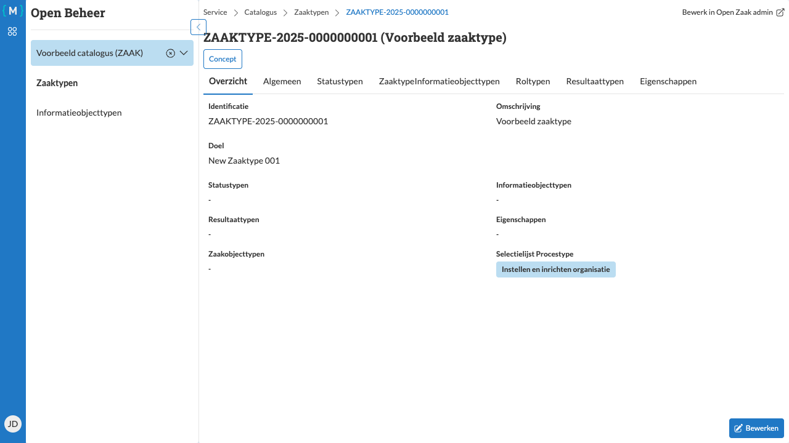

============================
Naar een zaaktype navigeren
============================

   Zaaktype detailpagina met overzicht tab

Vanuit het zaaktypen overzicht kunt u naar de detailpagina van een specifiek zaaktype navigeren.

Stappen
=======

1. Navigeer naar het zaaktypen overzicht (zie :doc:`overzicht`)
2. Klik in de tabel op het **identificatienummer** of de **omschrijving** van het gewenste zaaktype

Detailpagina
============

De detailpagina van een zaaktype bevat verschillende tabbladen:

**Overzicht**
   Toont een samenvatting van het zaaktype

**Algemeen**
   Bevat de basis eigenschappen van het zaaktype

**Statustypen**
   Overzicht van alle statustypen die aan dit zaaktype zijn gekoppeld

**Zaaktypeinformatieobjecttypen**
   Koppeling tussen dit zaaktype en informatieobjecttypen

**Roltypen**
   Overzicht van alle roltypen die bij dit zaaktype horen

**Resultaattypen**
   Overzicht van mogelijke resultaattypen van zaken van dit type

**Eigenschappen**
   Extra eigenschappen die aan zaken van dit type kunnen worden toegevoegd

Vanuit deze pagina kunt u het zaaktype bewerken (zie :doc:`bewerken`), gerelateerde objecten beheren, en het zaaktype
publiceren (zie :doc:`publiceren`).
