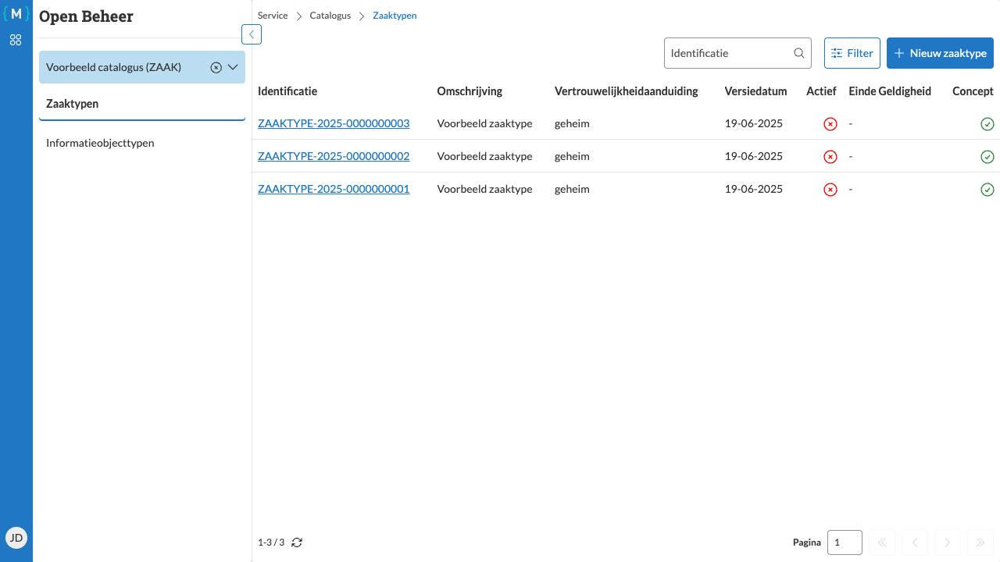

========================
Zaaktypen overzicht
========================

   Zaaktypen overzicht tabel

Het zaaktypen overzicht geeft een volledig overzicht van alle zaaktypen binnen de geselecteerde catalogus.

Naar het overzicht navigeren
============================

1. Log in en selecteer een catalogus (zie :doc:`../login` en :doc:`../catalogus-selecteren`)
2. Klik in het hoofdmenu op de knop **Zaaktypen**

Het overzicht
=============

Het overzicht toont een tabel met de volgende kolommen:

**Identificatie**
   Het unieke identificatienummer van het zaaktype

**Omschrijving**
   Een beschrijvende naam van het zaaktype

**Vertrouwelijkheidaanduiding**
   Het niveau van vertrouwelijkheid (bijvoorbeeld openbaar, intern)

**Versiedatum**
   De datum waarop deze versie van het zaaktype geldig werd

**Actief**
   Geeft aan of het zaaktype actief is (Ja/Nee)

**Einde Geldigheid**
   De datum waarop het zaaktype niet meer geldig is (indien van toepassing)

**Concept**
   Geeft aan of het zaaktype nog een concept is (Ja) of al gepubliceerd is (Nee)

Acties
======

Vanuit dit overzicht kunt u:

- Klikken op een zaaktype om de details te bekijken (zie :doc:`navigeren`)
- Een nieuw zaaktype aanmaken via de knop **Nieuw zaaktype** (zie :doc:`aanmaken`)
